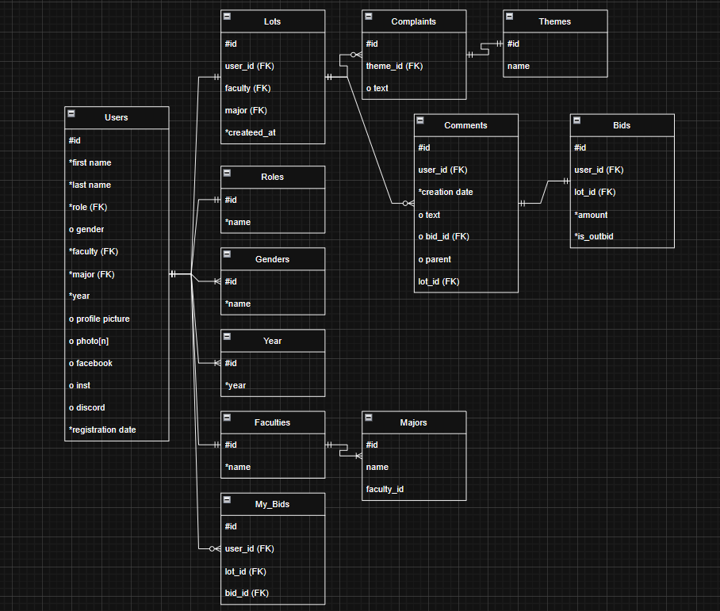

# Dating Auction Pro

### Team Members
- **Sophia Chernukha**  
- **Daria Spirina**  
- **Dora Hrechko**

---

## Overview
**Dating Auction Pro** — is an updated and improved version of the original project *Dating Auction by FiDo*. 
The goal of this project is to create a more modern, convenient and interactive platform for an annual event.

## Features
- **User Registration** - ability to registrate and take part in an auction.
- **Create your own lot**
- **Place bets** - place a bet on other users` lots.
- **Explore lots** 

## Pages
- **Registration / Login**
- **Home Page**
- **Lot Page**
- **Complaints**
- **Profile**
- **My Lot**
- **Rules**
- **My Bids**
- **Feedback**

---

## Registration / Login
- Header contains a link to **Rules**.  
- Footer contains a link to **Feedback**.  
- Authentication via **Microsoft Office 365**.  
- After successful login or registration, the user is redirected to the **Home Page**.

---

## Home Page
**Header includes:**  
`Auction | My Lot | My Bids | Profile | Rules | Logout`

**Search:**  
- By first name  
- By last name  

**Filters:**  
- Lot price (ascending / descending)  
- Lot creation date  
- Faculty  
- Gender  
- Year of study  
- Photo availability  
- Role  

**Display:**  
- Lots shown with pagination — **12 lots per page** (configurable).

---

## Lot Page
**Displays:**  
- Lot number  
- First name, last name  
- Photos (one at a time, with navigation)  
- Faculty, major, year of study  
- Description  
- Comments and bids (shared section)

**Functionality:**  
- Users can leave comments and bids.  
- Users can reply to other comments or bids.  
- Comments and bids are stored in the same structure.

**Validation rules for bids:**  
- `bid ≥ previous_bid + 10`  
- `bid ≤ 10,000`  
- If it’s just a comment (no bid) → `bid = null`.

---

## Complaints
- Accessible from the **Lot Page**.  
- The user ID of the person being reported is automatically included.  
- To prevent spam, the database stores **who submitted the complaint**.  
- The user selects a **complaint type** from a predefined list.  
- If "Other" is selected, the user can enter a custom text describing the complaint.  
  *(Optionally, a text field can be available for all types.)*

---

## Technologies
- **Backend:** Django, PostgreSQL  
- **Frontend:** React  
- **Auth:** Microsoft Office 365 (Single Tenant)  
- **Third-party API:** SoundCloud integration for user music on lots
- **Additional tools:** Discord bot integration, Outlook email notifications  

---

## SoundCloud Integration
Each user can attach a **SoundCloud track** to their lot.  
The track will appear as an embedded **SoundCloud player** on the lot’s page —  
users can listen directly or open the song on SoundCloud.

